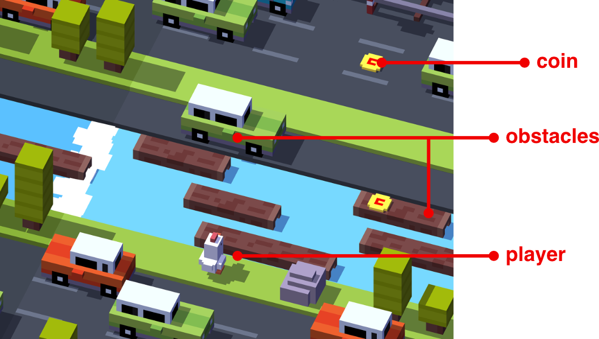

# operating-systems-project
### Plan:
A game similar to Crossy Road

### Threads:
- Controlling player's movement
- Generating and moving obstacles
- Generating coins/bonuses of some kind
- Monitoring and displaying player's score
- GUI handling

### Critical sections:
- A mutex synchronizing access to screen/window
- A semaphore for controlling how many coins/bonuses might be in the game
- A semaphore notifying all threads when the game is over/all lives are lost or sth
- A mutex controlling which thread might play sound effects